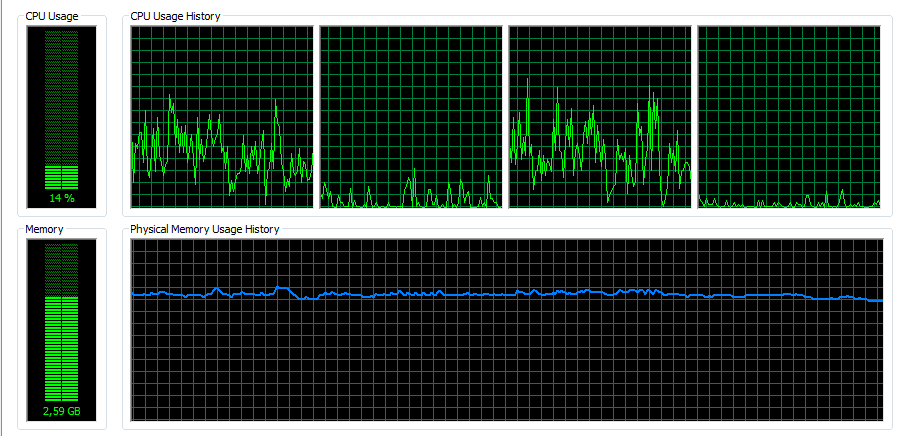
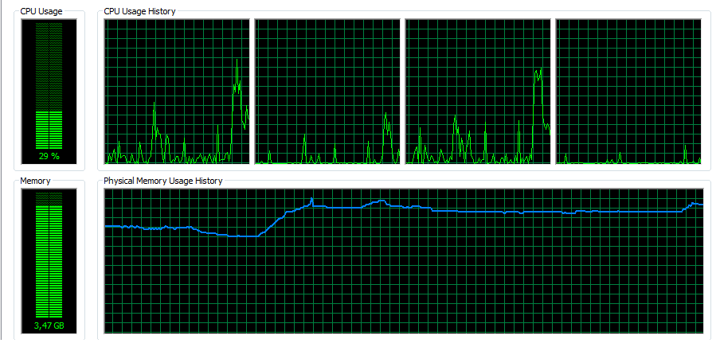
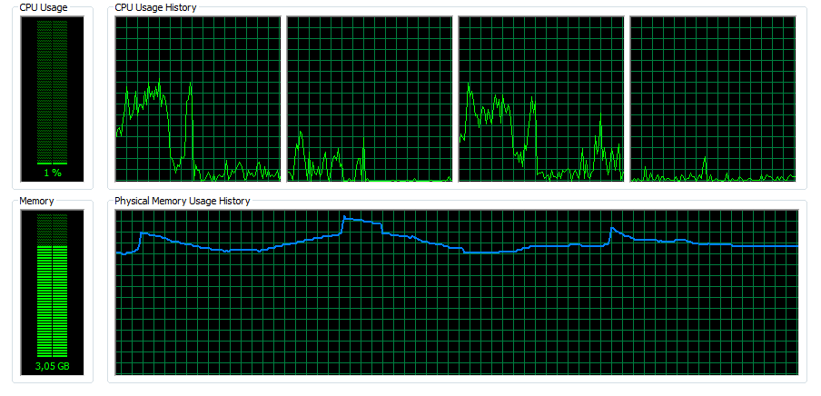
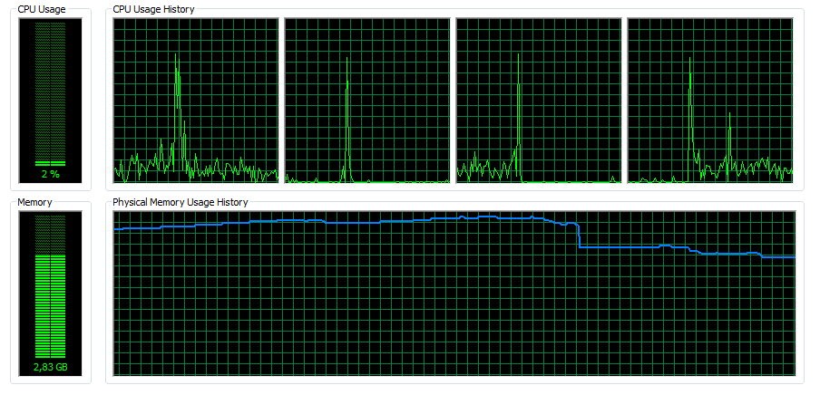

# Table of content

- [System info](#system-info)
- [Starting MongoDB](#starting-mongodb)
- [Short replies](#short-replies)
    - [Zadanie 1a](#1a)
        - [MongoDB](#mongodb)
        - [PostgreSQL](#postgresql)
    - [Zadanie 1b](#1b)
        - [MongoDB](#mongodb-1)
        - [PostgreSQL](#postgresql-1)
    - [Zadanie 1c](#1c)
    - [Zadanie 1d](#1d)
- [Extended Replies](#extended-replies)
    - [Zadanie 1a](#1a-1)
        - [Zmiana kodowanie (mongoDB)](#zmiana-kodowanie)
        - [Import do baz danych](#import-danych-do-bazy)
            - [MongoDB 2.6](#mongodb-26-1)
            - [MongoDB 2.8rc](#mongodb-28rc-1)
            - [PostgreSQL](#postgresql-2)
    - [Zadanie 1c](#1c-1)
         - [Tabelka czasowa](#tabelka-czasowa)
    - [Zadanie 1d](#1d-1)
        - [Przygotowanie danych](#przygotowanie-danych)
        - [Import do bazy danych](#import-danych-do-bazy-1)
        - [Przygotowanie kolekcji](#przygotowanie-kolekcji-geo-converttojsonjs)
        - [1 przykład](#1)
        - [2 przykład](#2)
        - [3 przykład](#3)
        - [3 przykład](#4)
        - [5 przykład](#5)
        - [6 przykład](#6)
- [Dodatkowe informacje o kolekcji geoAlabama](#dodatkowe-informacje-o-kolekcji-geoalabama)
- [Podsumowanie czasów](#podsumowanie-czasowe)

    

# System info

```bash
MongoDB shell version: 2.6.5
Processor: Intel Core i3-330M 2.13 GHz
RAM: 4GB
```


#Starting MongoDB

```bash
mongod --smallfiles --dbpath path_to_cluster
```

# Short replies
##1a
```text 
Zadanie 1a polega na zaimportowaniu, do baz danych
uruchomionych na swoim komputerze, danych z pliku Train.csv 
```
####MongoDB 2.6:
```sh  
 $ time 2unix.sh Train.csv TrainPrepare.csv   
 $ time mongoimport -c train --type csv --headerline --file TrainPrepared.csv 
```

####MongoDB 2.8rc:
```sh  
 $ time 2unix.sh Train.csv TrainPrepare.csv   
 $ time mongoimport -c train --type csv --headerline --file TrainPrepared.csv 
```

####PostgreSQL 

```SQL
CREATE TABLE train(
   id TEXT PRIMARY KEY     NOT NULL,
   Title           TEXT,
   Body            TEXT,
   Tags        TEXT
);

copy train(Id,Title,Body,Tags) from 'C:\Train.csv' with delimiter ',' csv header
```


##1b

 ```
 Zliczyć liczbę zaimportowanych rekordów
 ```
 
####MongoDB
 ```bash   
 $ db.train.count()
 ```
 

####PostgreSQL
 ```SQL
 select count(*) from train;
 > 6034195
 ```

##1c
```
Zamienić string zawierający tagi na tablicę napisów z tagami następnie zliczyć wszystkie tagi i wszystkie różne tagi.
``` 
```
 $ npm install
 $ node skrypt.js
```

##1d

```
Wyszukać w sieci dane zawierające obiekty GeoJSON. Następnie dane
zapisać w bazie MongoDB.
 
Dla zapisanych danych przygotować co najmniej 6 różnych geospatial
queries (w tym, co najmniej po jednym, dla obiektów Point, LineString
i Polygon).
```


# Extended Replies

##1a
#### Zmiana kodowanie
```sh  
 $ time 2unix.sh Train.csv TrainPrepare.csv   
```
|  Rodzaj               | Czas              | 
|-----------------------|-------------------|
|real                   |   22m2.507s       | 
|user                   |   3m32.282s       |  
|sys                    |   2m22.363s       |  

 
Jak widać proces zmiany znaków zajął dość sporo czasu (też słaby komputer do takich operacji), jednak jak widać po zdjęciu system zostawił sobie trochę pamięci to innych procesów:



###Import danych do baz

####MongoDB
```  
  $ time mongoimport -c train --type csv --headerline --file TrainPrepared.csv 
```

|  Rodzaj               | MongoDB 2.6              |  MongoDB 2.8rc |
|-----------------------|-------------------|--------------------|
|real                   |   39m2.516s       |   38m32.348s  |
|user                   |   11m45.381s      |    10m11.381s     |
|sys                    |   3m11m127s       |  2m09m127s    |
 


Na monitorze zasobów start importera jest bardzo dobrze widoczny: 

Przy importowaniu komputer był bardzo obciążony. Praktycznie przez cały proces importu nie dało się z niego korzystać.

Co ciekawe, nawet po zakończonym imporcie, proces mongoimport nie zwolnił używanej przez siebie pamięci. Nawet godzinę po zakończonym imporcie komputer był bardzo spowolniony. Pomógł dopiero restart systemu.

Ciekawą rzecz można również zaobserwować gdy odłączy się laptopa od zasilacza. Ewidentnie spada wtedy wydajność komputera co widać na obrazku:


#####Statystyki dla kolekcji "train"
```json
> db.train.stats()
{
        "ns" : "test.train",
        "count" : 2017332,
        "size" : 3550925520,
        "avgObjSize" : 1760,
        "storageSize" : 4841103360,
        "numExtents" : 23,
        "nindexes" : 1,
        "lastExtentSize" : 1257897984,
        "paddingFactor" : 1,
        "systemFlags" : 1,
        "userFlags" : 1,
        "totalIndexSize" : 65465232,
        "indexSizes" : {
                "_id_" : 65465232
        },
        "ok" : 1
}
```


####PostgreSQL

Importowanie zajęło 45 minut i 21 sekund.


## 1c

Przygotowałem 2 skrytpy zmieniające format danych String na tablice tagów. W tych skryptach wykrywanie stringa odbywa się poprzez wykrycie spacji. Po spacji następuje rozdzielenie string na elementy tablicy. 
Skrtypty różnią się sposobem zapisu zmienionych danych.

[Skrypt 1](convert.js) działa w taki sposób, że znajduje rekord, wprowadza w nim zmiany i uaktualnia w danej kolecji dany rekord. 

[Skrypt 2](convert2.js) działa w trochę inny sposób. Skrypt znajduję rekord, wprowadza w nim zmiany i dodaje do swojej wewnętrznej listy. Jeśli lista osiągnie wielkość 1000 rekordów, taka paczka jest przesyłania do nowej kolekcji. 

Czasy tych dwóch skryptów puszczonych na tej samej kolekcji są trochę inne.

```
 $ npm install
 $ node convert.js    
```

###Tabelka czasowa

|  Rodzaj               | Mongo 2.6-[Skrypt 1](convert.js) | Mongo 2.6-[Skrypt 2](convert2.js) | MongoDB 2.8rc-[Skrypt 1](convert.js) | MongoDB 2.8rc-[Skrypt 2](convert2.js)
|-----------------------|-------------------|--------------------|---------------------|---------------------|
|real                   |   62m28.113s      | 47m52.190s         | 58m31.145s   | 47m52.190s
|user                   |   05m09.321s      |  03m09.111s        | 04m11.126s    | 03m09.111s
|sys                    |   01m30.125s      |  0m00.127s         | 01m15.127s     | 0m00.127s


Jak widać czas skryptu wysyłającego paczki jest trochę krótszy. 


#####Przykładowy rekord po puszczeniu [Skrypt](convert.js)
```json
{
  "_id" : ObjectId("526e9eea0d0994b3ea766bc5"),
  "Id" : 1,
  "Title" : "How to check if an uploaded file is an image without mime type?",
  "Body" : "<p>I'd like to check if an uploaded file is an image file (e.g png, jpg, jpeg, gif, bmp)
  or another file. The   problem is that I'm using Uploadify to upload the files, which changes the
  mime type and gives a 'text/octal' or    something as the mime type, no matter which file type you
  upload.</p>  <p>Is there a way to check if the uploaded file    is an image apart from checking the
  file extension using PHP?</p> ",
  "Tags" : [
    "php",
    "image-processing",
    "file-upload",
    "upload",
    "mime-types"
  ]
}
```


## 1d

##### Opis:
Zbiór danych: http://geonames.usgs.gov/docs/stategaz/AL_Features_20141005.zip  

Zbiór zawiera dane na temat punktów szczegołnych (takich jak rzeka, czy cmentarz) w wybranym przeze mnie stanie w Stanach Zjednoczonych (dokładnie Alabama)
Sciągniętą paczkę trzeba wypakować i odpowiednio dane przygotować do współpracy.


###### Przygotowanie danych: 

```
$ tr tr '|' ',' < AL_Features_20141005.txt > geo.txt
```

###### Import danych do bazy:
```
$mongoimport -c geo -type csv -file geo.txt --headerline
```
###### Przygotowanie kolekcji ``geo`` [convertToJSON.js](convertToJSON.js)
```
$ db.geoAlabama.ensureIndex({"loc" : "2dsphere"})
$ var punkt = {type: "Point", coordinates: [ -86.8877693,33.4698294]} 
```
---------------
#####1
Znajdz punkty w odległość od 100 do 65000
Query:
```
$ db.geoAlabama.find({ loc: {$nearSphere:{$geometry:punkt,$minDistance:100,$maxD
istance:65000}}})
```

Wynik: [zobacz](json/1.json)
Mapka: [zobacz](geojson/1near.geojson)

#####2
---------
Znajdź punkty w określonym współrzędnymi polu:
```
$ db.geoAlabama.find({
    loc: {
        $geoWithin: {
            $polygon: [
                [
                    -88.3822308,
                    33.3579777
                ],
                [
                    -86.2504893,
                    33.5718352
                ],
                [
                    -86.7569171,
                    34.9495258
                ],
                [
                    -84.8747566,
                    34.7098128
                ]
            ]
        }
    }
})
```
Wynik: [zobacz](json/2.json)
Mapka: [zobacz](geojson/2polygon.geojson)

#####3
-------
Znajdź 3 najbliższe punkty typu rzeka/strumień
```
$ db.geoAlabama.find({
    loc: {
        $near: {
            $geometry: punkt
        }
    },
    type: "Stream"
}).limit(3)
```

Wynik: [zobacz](json/3.json)
Mapka: [zobacz](geojson/nearestPoint.geojson)


#####4
--------
Znajdz puknty w wycinku kołowym określonym stopniami 
```
$ db.geoAlabama.find({
    loc: {
        $geoWithin: {
            $centerSphere: [
                [
                    -86.5683234,
                    33.985376
                ],
                13/3959
            ]
        }
    }
})
```


Wynik: [zobacz](json/4.json)
Mapka: [zobacz](geojson/circlePoints.geojson)


#####5
--------
Punkty typu rzeka/strumień znajdujące się powyżej 230m
```
$ db.geoAlabama.find({
    loc: {
        $near: {
            $geometry: punkt
        }
    },
    type: "Stream",
    height: {
        $gt: 230
    }
})
```

Wynik: [zobacz](json/5.json)
Mapka: [zobacz](geojson/streamWithGt200.geojson)

#####6
--------
Punkty w wycinku kołowym z wykorzystaniem "center"
``` 
$ db.geoAlabama.find({
    loc: {
        $geoWithin: {
            $center: [
                [
                    -90.5683234,
                    31.985376
                ],
                10/4
            ]
        }
    }
})
```

Wynik: [zobacz](json/5.json)
Mapka: [zobacz](geojson/circle.geojson)

#Dodatkowe informacje o kolekcji geoAlabama:
```
{
        "ns" : "test.geoAlabama",
        "count" : 51,
        "size" : 12240,
        "avgObjSize" : 240,
        "storageSize" : 22507520,
        "numExtents" : 7,
        "nindexes" : 2,
        "lastExtentSize" : 11325440,
        "paddingFactor" : 1,
        "systemFlags" : 1,
        "userFlags" : 1,
        "totalIndexSize" : 16352,
        "indexSizes" : {
                "_id_" : 8176,
                "loc_2dsphere" : 8176
        },
        "ok" : 1
}
```


# Podsumowanie czasowe

|  Czynność             | Czas rzeczywisty  | 
|-----------------------|-------------------|
|Zmiana kodowania       |   22m2.507s       | 
|Import                 |   39m2.516s       |  
|Konwertowanie          |   14m31.145s      |  

