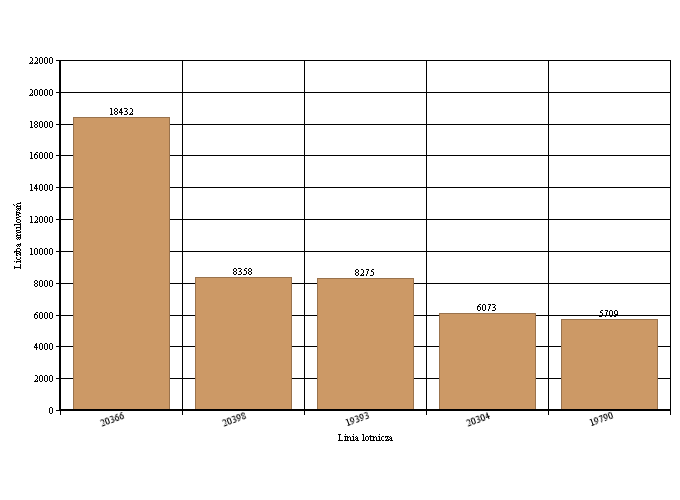
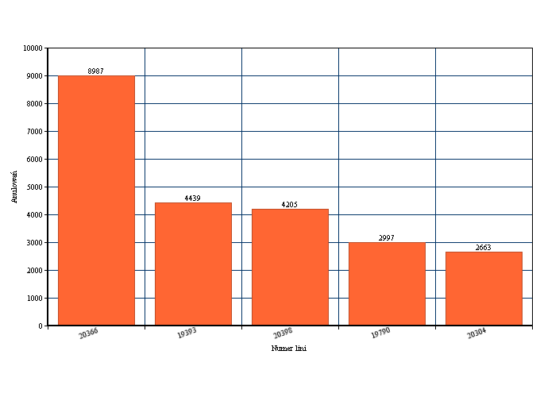
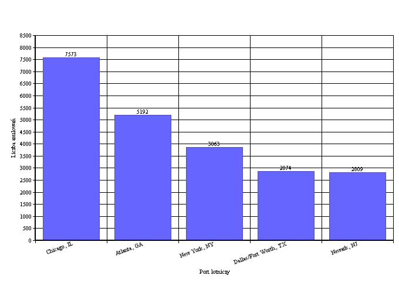
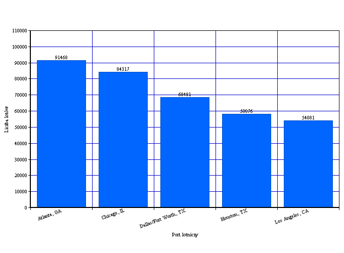
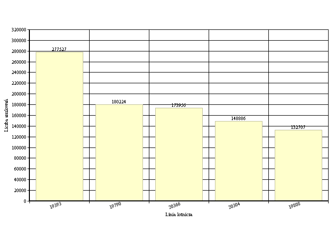
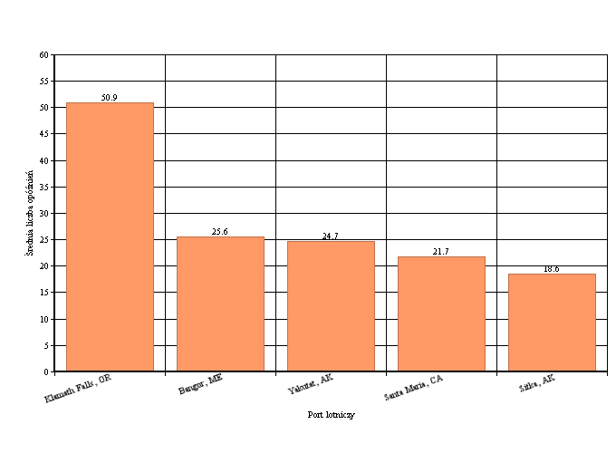

#Zadanie 2
---


- [Dane](#dane)
- [Liczba rekordów](#liczba-rekordów)
- [Agregacje](#agregacje)
- [Skrypt JavaScript](#skrypt-w-javascript-na-wykonywanie-i-parsowanie-agregacji)
- [Java](#java)


##Dane 

Zbiorem danych jakim się posługuje przy tym zadaniu są dane na temat ruchu lotniczego w Stanach Zjednoczonych. Średnio jeden miesiąc zawiera około 500tyś. rekordów. Przy moich agregacjach użyje danych z okresu 3 miesięcy.

##Liczba rekordów

```
1406309
```

##Agregacje

###1 Agregacja pokazująca Linie lotniczą z największą liczbą anulowanych lotów

```js
db.airtest.aggregate({
	$match: {
		AIRLINE_ID: {
			$ne: ""
		}
	}
}, {
	$group: {
		_id: "$AIRLINE_ID",
		cancelled: {
			$sum: "$CANCELLED"
		}
	}
}, {
	$sort: {
		cancelled: -1
	}
}, {
	$limit: 5
})
```

####Wynik:

```json
{ "_id" : 20366, "cancelled" : 18432 }
{ "_id" : 20398, "cancelled" : 8358 }
{ "_id" : 19393, "cancelled" : 8275 }
{ "_id" : 20304, "cancelled" : 6073 }
{ "_id" : 19790, "cancelled" : 5709 }
```



-----

###2 Agregacja pokazująca numery lini lotniczych z największą liczbą anulowań w miesiącu styczniu

```js
db.airtest.aggregate({
	$match: {
		MONTH: 1
	}
}, {
	$group: {
		_id: "$AIRLINE_ID",
		cancelled: {
			$sum: "$CANCELLED"
		}
	}
}, {
	$sort: {
		cancelled: -1
	}
}, {
	$limit: 5
})
```

####Wynik

```json
{ "_id" : 20366, "cancelled" : 8987 }
{ "_id" : 19393, "cancelled" : 4439 }
{ "_id" : 20398, "cancelled" : 4205 }
{ "_id" : 19790, "cancelled" : 2997 }
{ "_id" : 20304, "cancelled" : 2663 }
```




###3 Porty lotnicze z największą liczbą anulowanych lotów

```json
db.airline.aggregate({
	$match: {
		AIRLINE_ID: {
			$ne: ""
		}
	}
}, {
	"$group": {
		"_id": "$DEST_CITY_NAME",
		"cancelled": {
			"$sum": "$CANCELLED"
		}
	}
}, {
	$sort: {
		cancelled: -1
	}
}, {
	$limit: 5
})
```

####Wynik

```json
{ "_id" : "Chicago, IL", "cancelled" : 7573 }
{ "_id" : "Atlanta, GA", "cancelled" : 5192 }
{ "_id" : "New York, NY", "cancelled" : 3863 }
{ "_id" : "Dallas/Fort Worth, TX", "cancelled" : 2874 }
{ "_id" : "Newark, NJ", "cancelled" : 2809 }
```




###4 Najpopularniejsze porty lotnicze

```json
db.airline.aggregate([{
	"$group": {
		"_id": "$DEST_CITY_NAME",
		"value": {
			"$sum": 1
		}
	}
}, {
	"$sort": {
		"value": -1
	}
}, {
	"$limit": 5
}]);
```

####Wynik

```json
{ "_id" : "Atlanta, GA", "value" : 91468 }
{ "_id" : "Chicago, IL", "value" : 84317 }
{ "_id" : "Dallas/Fort Worth, TX", "value" : 68481 }
{ "_id" : "Houston, TX", "value" : 58076 }
{ "_id" : "Los Angeles, CA", "value" : 54081 }
```



###5 Najpopularniejsze linie lotnicze

```json
db.airline.aggregate([{
	"$group": {
		"_id": "$AIRLINE_ID",
		"value": {
			"$sum": 1
		}
	}
}, {
	"$sort": {
		"value": -1
	}
}, {
	"$limit": 5
}]);
```

####Wynik

```json
{ "_id" : 19393, "value" : 277527 }
{ "_id" : 19790, "value" : 180224 }
{ "_id" : 20366, "value" : 173956 }
{ "_id" : 20304, "value" : 148886 }
{ "_id" : 19805, "value" : 132707 }
```



###6 Liczba opóźnień spowodowanych złymi warunkami atmosferycznymi (do 15 do 20 minut)


```json
db.airline.aggregate([{
	$match: {
		"WEATHER_DELAY": {
			$gt: 15,
			$lte: 20
		}
	}
}, {
	$group: {
		_id: "Weather_cast",
		count: {
			$sum: 1
		}
	}
}]);
```

####Wynik

```json
{ "_id" : "Weather_cast", "count" : 2225 }
```


###7 Miasta portów lotniczych z największym średnim czasem opóźnienia

```json
db.airline.aggregate([{
	$group: {
		_id: {
			city: "$ORIGIN_CITY_NAME"
		},
		avg_score: {
			$avg: "$WEATHER_DELAY"
		}
	}
}, {
	$sort: {
		avg_score: -1
	}
}, {
	$limit: 5
}]);
```

####Wynik
```json
{ "_id" : { "city" : "Klamath Falls, OR" }, "avg_score" : 50.875 }
{ "_id" : { "city" : "Bangor, ME" }, "avg_score" : 25.958333333333332 }
{ "_id" : { "city" : "Yakutat, AK" }, "avg_score" : 24.666666666666668 }
{ "_id" : { "city" : "Santa Maria, CA" }, "avg_score" : 21.70212765957447 }
{ "_id" : { "city" : "Sitka, AK" }, "avg_score" : 18.61111111111111 }
```



#JavaScript

##Skrypt w JavaScript na wykonywanie i parsowanie agregacji.

[Skrypt](aggregate.js)

W kodzie programu zaszyte są takie same agregacje jak wyżej.

Wynik działania programu:

```text
MongoDB Połączono!

-----------------------------------
Collection count = 1406309

-----------------------------------
Samoloty anulowane w danym miesiacu

Samolot numer: 20366 anulowany: 8987 razy
Samolot numer: 19393 anulowany: 4439 razy
Samolot numer: 20398 anulowany: 4205 razy
Samolot numer: 19790 anulowany: 2997 razy
Samolot numer: 20304 anulowany: 2663 razy

-----------------------------------
Najpopularniejsze porty lotnicze

Port: Atlanta, GA lotów: 91468
Port: Chicago, IL lotów: 84317
Port: Dallas/Fort Worth, TX lotów: 68481
Port: Houston, TX lotów: 58076
Port: Los Angeles, CA lotów: 54081

-----------------------------------
Największe średnie opóźnienia w miastach portów lotniczych

Miasto:  Klamath Falls, OR średnia liczba: 50.875
Miasto:  Bangor, ME średnia liczba: 25.958333333333332
Miasto:  Yakutat, AK średnia liczba: 24.666666666666668
Miasto:  Santa Maria, CA średnia liczba: 21.70212765957447
Miasto:  Sitka, AK średnia liczba: 18.61111111111111

-----------------------------------
Porty lotnicze z najwieksza iloscia anulowanych lotow

Port lotniczy: Chicago, IL liczba anulowań: 7573 razy
Port lotniczy: Atlanta, GA liczba anulowań: 5192 razy
Port lotniczy: New York, NY liczba anulowań: 3863 razy
Port lotniczy: Dallas/Fort Worth, TX liczba anulowań: 2874 razy
Port lotniczy: Newark, NJ liczba anulowań: 2809 razy

-----------------------------------
Samoloty anulowane ogółem

Samolot numer: 20366 anulowany: 18432 razy
Samolot numer: 20398 anulowany: 8358 razy
Samolot numer: 19393 anulowany: 8275 razy
Samolot numer: 20304 anulowany: 6073 razy
Samolot numer: 19790 anulowany: 5709 razy

-----------------------------------
Najpopularniejsze linie lotnicze

Numer lini: 19393 wykonanych lotów: 277527
Numer lini: 19790 wykonanych lotów: 180224
Numer lini: 20366 wykonanych lotów: 173956
Numer lini: 20304 wykonanych lotów: 148886
Numer lini: 19805 wykonanych lotów: 132707

-----------------------------------
Liczba opóźnień spowodowych pogodą w długości opóźnienia pomiędzy 15 - 20 minut


Liczba opóźnień 2225

```


#Java

[Kod](mongo/src/main/java/Main.java)
